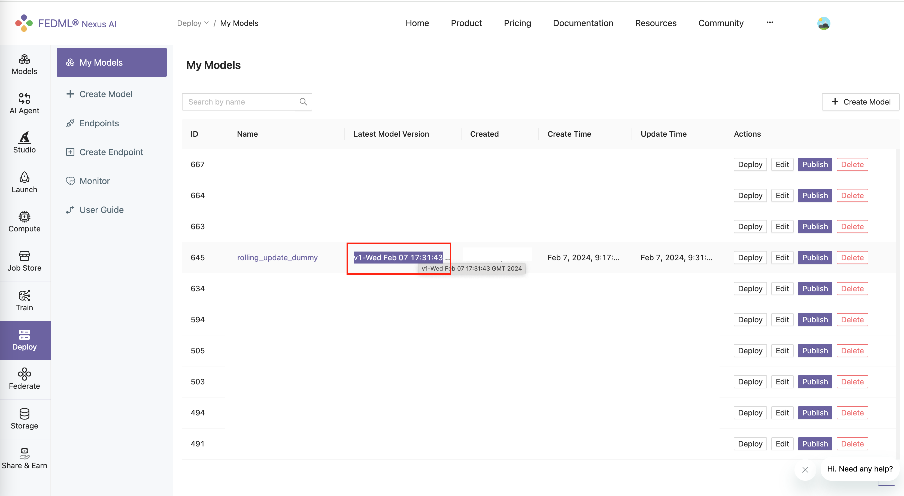
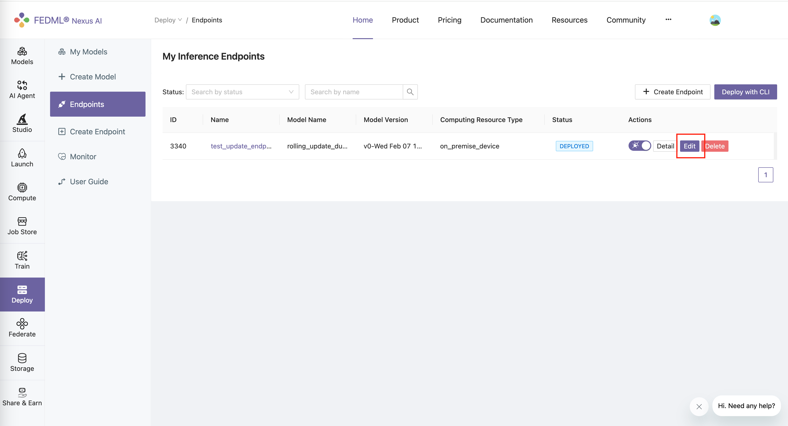
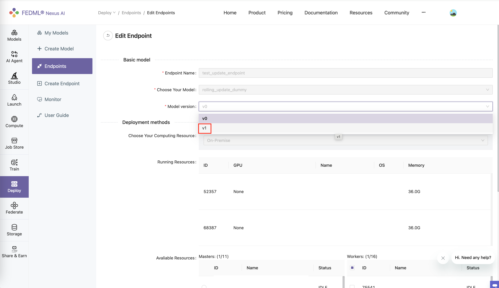

# Manage Your Endpoint
## Run Anywhere
### Run in CLI
`fedml model run -e $endpoint_id $json_string`

For more information, please refer to 
[FedML Model Run CLI](/docs/open-source/cli/fedml-model.md#fedml-model-run-options-json_string).

### Other Language Support
We support language bindings for **Python, Java, JQuery, etc**.
After you deploy a model card to Nexus AI Platform, you can go to "Deploy" -> "Endpoints" -> Your Endpoint.


## Update Your Endpoint
### Update the model card
Suppose you make some changes to your model card, from: 
```python
def predict(self, request):
    return {f"AlohaV1From{self.worker_id}": request}
```

to:

```python
def predict(self, request):
    return {f"AlohaV2From{self.worker_id}": request}
```

Recreate the model card, then upload to the Nexus AI Platform. By using:
```bash
fedml model create -n $model_card_name -cf $config_file
```
```bash
fedml model push -n $model_card_name
```
You can see the model card has been updated on the Nexus AI Platform.


### Edit the endpoint
Assume you have a existed endpoint under "Deploy" -> "Endpoints" -> Your Endpoint.


Click "Edit" button.


Select the new model card version.


click "Update" button.


By default, the update will use a scrolling update strategy. Which means, it only updates 
a small portion of the devices at a time. This can ensure that this endpoint is always available when updating.

You can change the ratio of the devices that you want to update at a time, using the following parameter in 
the `config.yaml` file:
```yaml
max_unavailable_rate: 0.5
```


