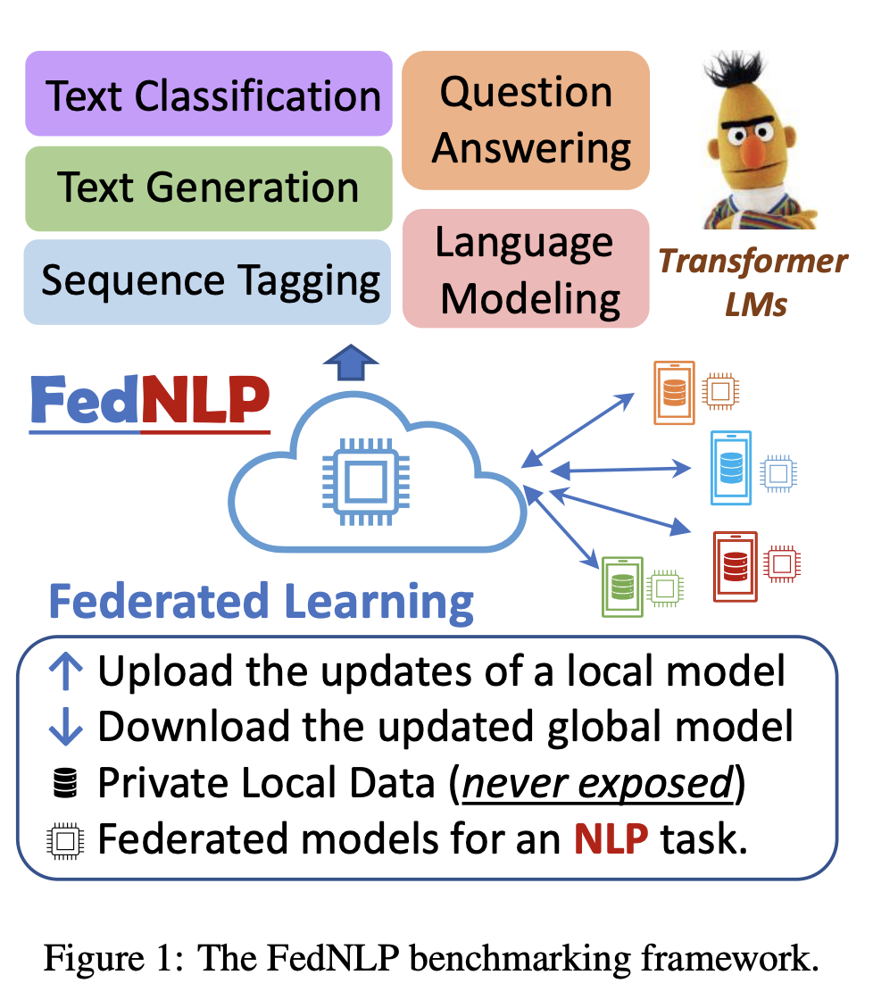
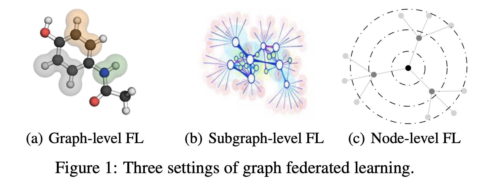
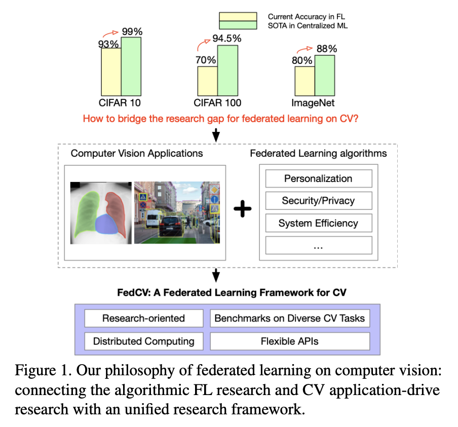
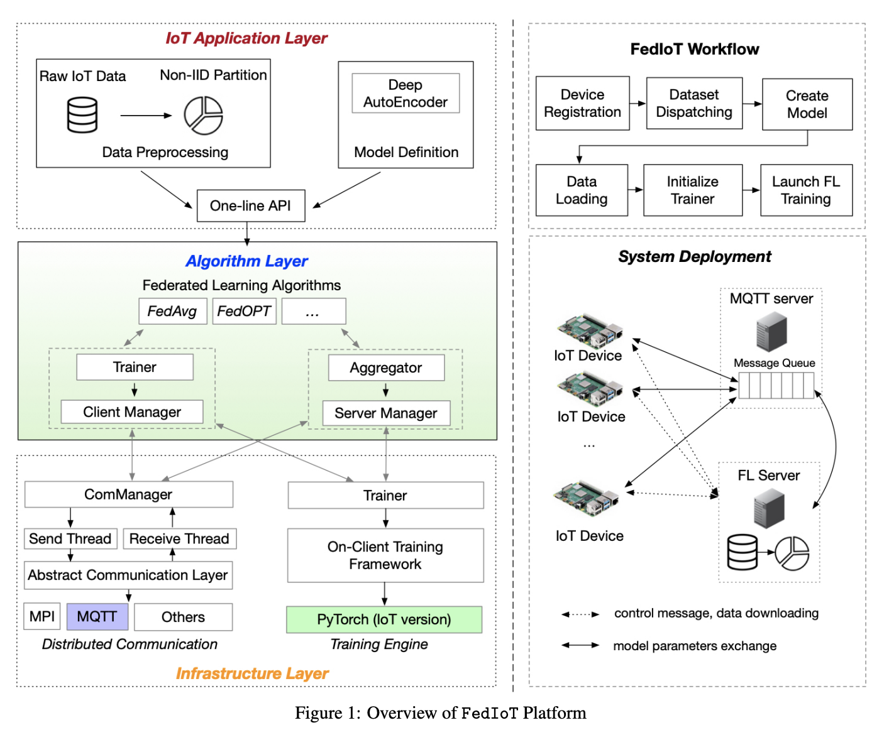

# Pre-built Jobs and Examples

## Examples
We provide examples at https://github.com/FedML-AI/FedML/blob/master/python/examples/README.md to cover following use cases:

1. Multiple scenarios: Cross-silo Federated Learning; Cross-device Federated Learning; FL Simulation with Single Process or Distributed Computing.

2. Support any machine learning framework: PyTorch, TensorFlow, JAX with Haiku, and MXNet.

3. Diverse communication backends (MPI, gRPC, PyTorch RPC, MQTT + S3)
Secure Aggregation (multi-party computation): cross_silo/light_sec_agg_example

## Pre-built Jobs
The FEDML®Federate Pre-built Job facilitates federated learning research and productization in diverse application domains. With the foundational support from FedML Core Framework, it supports FedNLP (Natural Language Processing), FedCV (Computer Vision), FedGraphNN (Graph Neural Networks), and FedIoT (Internet of Things).

The source code of these pre-built jobs (applications for federated learning) are maintained at https://github.com/FedML-AI/FedML/tree/master/python/examples/federate/prebuilt_jobs/

### FedNLP: Benchmarking Federated Learning Methods for Natural Language Processing Tasks
Arxiv: [https://arxiv.org/pdf/2104.08815.pdf](https://arxiv.org/pdf/2104.08815.pdf)

Published at NAACL 2022.

Increasing concerns and regulations about data
privacy and sparsity necessitate the study
of privacy-preserving, decentralized learning methods for natural language processing
(NLP) tasks. Federated learning (FL) provides promising approaches for a large number of clients (e.g., personal devices or organizations) to collaboratively learn a shared
global model to benefit all clients while allowing users to keep their data locally. Despite interest in studying FL methods for NLP
tasks, a systematic comparison and analysis is lacking in the literature. Herein, we
present the FedNLP, a benchmarking framework for evaluating federated learning methods on four different task formulations: text
classification, sequence tagging, question answering, and seq2seq. We propose a universal interface between Transformer-based language models (e.g., BERT, BART) and FL
methods (e.g., FedAvg, FedOPT, etc.) under
various non-IID partitioning strategies. Our
extensive experiments with FedNLP provide
empirical comparisons between FL methods
and helps us better understand the inherent
challenges of this direction. The comprehensive analysis points to intriguing and exciting
future research aimed at developing FL methods for NLP tasks.

### FedGraphNN: A Federated Learning Benchmark System for Graph Neural Networks
Arxiv: [https://arxiv.org/pdf/2111.11066.pdf](https://arxiv.org/pdf/2111.11066.pdf)

Published at ICLR'21-DPML and MLSys'21-GNNSys workshops

Graph Neural Network (GNN) research is rapidly growing thanks to the capacity of GNNs in learning distributed representations from graph-structured data.
However, centralizing a massive amount of real-world graph data for GNN training is prohibitive due to privacy concerns, regulation restrictions, and commercial
competitions. Federated learning (FL), a trending distributed learning paradigm,
provides possibilities to solve this challenge while preserving data privacy. Despite recent advances in vision and language domains, there is no suitable platform
for the FL of GNNs. To this end, we introduce FedGraphNN, an open FL benchmark system that can facilitate research on federated GNNs. FedGraphNN is
built on a unified formulation of graph FL and contains a wide range of datasets
from different domains, popular GNN models, and FL algorithms, with secure
and efficient system support. Particularly for the datasets, we collect, preprocess, and partition 36 datasets from 7 domains, including both publicly available ones and specifically obtained ones such as hERG and Tencent. Our
empirical analysis showcases the utility of our benchmark system, while exposing significant challenges in graph FL: federated GNNs perform worse in most
datasets with a non-IID split than centralized GNNs; the GNN model that attains the best result in the centralized setting may not maintain its advantage
in the FL setting. These results imply that more research efforts are needed
to unravel the mystery behind federated GNNs. Moreover, our system performance analysis demonstrates that the FedGraphNN system is computationally
efficient and secure to large-scale graphs datasets. 

### FedCV: A Federated Learning Framework for Diverse Computer Vision Tasks
Arxiv: [https://arxiv.org/pdf/2104.07145.pdf](https://arxiv.org/pdf/2104.07145.pdf)

Published at FL-AAAI’2022

Federated Learning (FL) is a distributed learning
paradigm that can learn a global or personalized model
from decentralized datasets on edge devices. However, in
the computer vision domain, model performance in FL is far
behind centralized training due to the lack of exploration in
diverse tasks with a unified FL framework. FL has rarely
been demonstrated effectively in advanced computer vision
tasks such as object detection and image segmentation. To
bridge the gap and facilitate the development of FL for
computer vision tasks, in this work, we propose a federated learning library and benchmarking framework, named
FedCV, to evaluate FL on the three most representative computer vision tasks: image classification, image segmentation,
and object detection. We provide non-I.I.D. benchmarking
datasets, models, and various reference FL algorithms. Our
benchmark study suggests that there are multiple challenges
that deserve future exploration: centralized training tricks
may not be directly applied to FL; the non-I.I.D. dataset
actually downgrades the model accuracy to some degree in
different tasks; improving the system efficiency of federated
training is challenging given the huge number of parameters and the per-client memory cost. We believe that such
a library and benchmark, along with comparable evaluation settings, is necessary to make meaningful progress in
FL on computer vision tasks

### FedIoT: Federated Learning for Internet of Things
Arxiv: [https://arxiv.org/pdf/2106.07976.pdf](https://arxiv.org/pdf/2106.07976.pdf)

Published at ACM Sensys’21

Federated learning can be a promising solution for enabling IoT cybersecurity (i.e., anomaly detection
in the IoT environment) while preserving data privacy and mitigating the high communication/storage overhead (e.g., high-frequency data from time-series sensors) of centralized over-the-cloud
approaches. In this paper, to further push forward this direction with a comprehensive study in
both algorithm and system design, we build FedIoT platform that contains FedDetect algorithm
for on-device anomaly data detection and a system design for realistic evaluation of federated
learning on IoT devices. Furthermore, the proposed FedDetect learning framework improves the
performance by utilizing a local adaptive optimizer (e.g., Adam) and a cross-round learning rate
scheduler. In a network of realistic IoT devices (Raspberry PI), we evaluate FedIoT platform and
FedDetect algorithm in both model and system performance. Our results demonstrate the efficacy
of federated learning in detecting a wider range of attack types occurred at multiple devices. The
system efficiency analysis indicates that both end-to-end training time and memory cost are affordable and promising for resource-constrained IoT devices.

