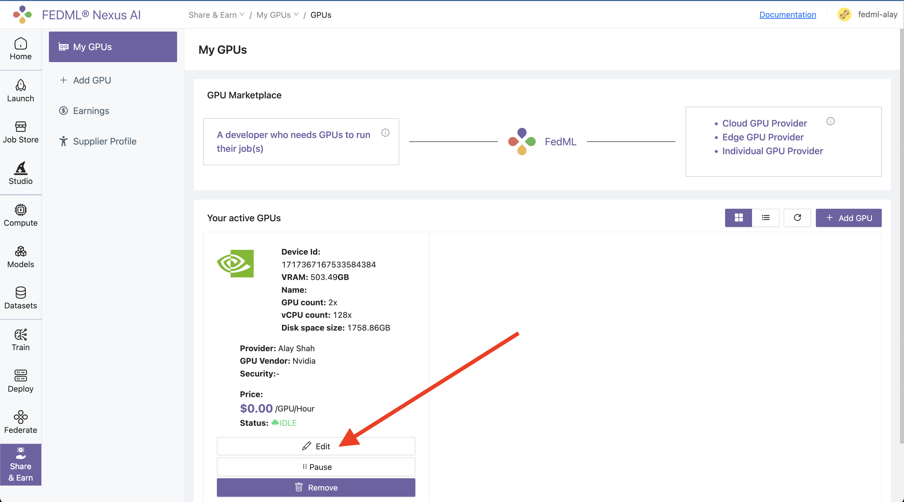
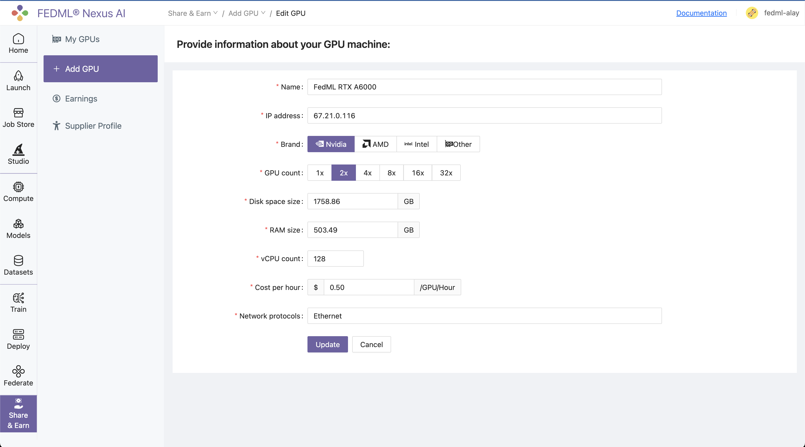

# Share GPUs and Earn

## 1. Supplier Setup 

### 1.1) Login to the FEDML® Nexus AI Platform and navigate to the `Share & Earn / Add GPU` page.


### 1.2) Setup Stripe account or just connect if you have one already to get paid by FedML, Inc.


## 2. Add GPUs

### 2.1) Prerequisites:
Need to have a GPU server with NVIDIA GPU(s) installed and CUDA drivers installed.
To check if nvidia drivers are installed, run the following command:

```bash
nvidia-smi
```

If you see the output with GPU details, you are good to go.

If you don't have nvidia drivers installed, you can first try to install them using the following command:

```bash
sudo ubuntu-drivers autoinstall
sudo apt install nvidia-cuda-toolkit
sudo reboot
nvidia-smi
```

If the above commands don't work, you can follow the instructions on NVIDIA's official website
[here](https://docs.nvidia.com/cuda/cuda-installation-guide-linux/index.html).

### 2.2) Download following script to the GPU server you want to bind:

[bind_gpu.sh](static/bind_gpu.sh)

> **Note**: Make sure to save the script with filename `bind_gpu.sh` on your GPU server.

Next, give execute permission to the script:

```bash
chmod +x bind_gpu.sh
```

Now, execute the script:

```bash
./bind_gpu.sh
```

This script will install the tools and software packages required for fedml library to work on your GPU server.

### 2.3) Verify the installation of fedml library:

```bash
fedml env
```

The output should look like below:

```bash
(fedml) ubuntu@fedml-a100-deploy:~$ fedml env

======== FedML (https://fedml.ai) ========
FedML version: 0.8.26
FedML ENV version: release
Execution path:/home/ubuntu/miniconda3/envs/fedml/lib/python3.10/site-packages/fedml/__init__.py

======== Running Environment ========
OS: Linux-5.15.0-94-generic-x86_64-with-glibc2.35
Hardware: x86_64
Python version: 3.10.13 (main, Sep 11 2023, 13:44:35) [GCC 11.2.0]
PyTorch version: 2.2.1+cu121
MPI4py is NOT installed

======== CPU Configuration ========
The CPU usage is : 0%
Available CPU Memory: 467.3 G / 472.1867256164551G

======== GPU Configuration ========
NVIDIA GPU Info:
Available GPU memory: 0.0 G / 0.0G
torch_is_available = False
device_count = 0
No GPU devices

======== Network Connection Checking ========
The connection to https://open.fedml.ai is OK.

The connection to S3 Object Storage is OK.

The connection to mqtt.fedml.ai (port:1883) is OK.
```

### 2.4) Verify the installation of docker on your GPU server:
```bash
(base) DGX-7% docker ps
CONTAINER ID IMAGE COMMAND  CREATED  STATUS  PORTS  NAMES```
```

Execute two commands given below to re-start the docker daemon if you see the following error:
```
Cannot connect to the Docker daemon at unix:///var/run/docker.sock. Is the docker daemon running?
```

```bash
1. sudo su
2. systemctl start docker
````


### 2.5) Navigate to `Share & Earn / Add GPU` page and copy one-line login command for binding your GPU servers.


#### From your GPU server terminal, execute the login command copied in from the platform.

Below is output of command when executed on a FedML® GPU server:

```
(fedml) alay@a6000:~$ fedml login -p 3b24dd2f****************206e8669

 Welcome to FedML.ai!
 Start to login the current device to the FedML® Nexus AI Platform

(fedml) alay@a6000:~$

Congratulations, your device is connected to the FedML MLOps platform successfully!
Your FedML Edge ID is 1717367167533584384, unique device ID is 0xa11081eb21f1@Linux.Edge.GPU.Supplier

You may visit the following url to fill in more information with your device.
https://fedml.ai/gpu-supplier/gpu/edit/1717367167533584384
```

As instructed by the output, next you need to visit the url to fill in more information about your GPU server.


## 3. Fill in GPU server details


### 3.1) Navigate to `Share & Earn / My GPUs` page and click on the `Edit` button to fill in more information about your GPU servers.


:::tip Tip
You can also click through or copy the url link in the terminal output of previous step into browser of your choice to directly go to the edit page.
:::




### 3.2) Fill in the details of your GPU server and click on `Update` button.

> **Note**: Most info is pre-filled for you. You just need to fill in the `GPU Name` and `Network Protocol` fields and set the cost per hour.

:::tip Tip
Be mindful while deciding Cost per hour for your GPU server. Setting the cost very high may put you at disadvantage as the matching algorithm prioritizes the cheaper GPU servers first.
:::



Head back to the `Share & Earn / My GPUs` page on platform and verify that the GPU server is added to your list of active GPUs:


## 4. Sit back, relax and get paid by FedML, Inc.

Hard part is over, now comes the fun part.

Your GPU server will automatically be added to the resource pool and jobs that match the specifications will be scheduled.


:::tip Tip
All you have to do is sit back, relax and get paid (💵) by FedML, Inc.
:::

You can also monitor your earnings on the `Share & Earn / Earnings` page:


