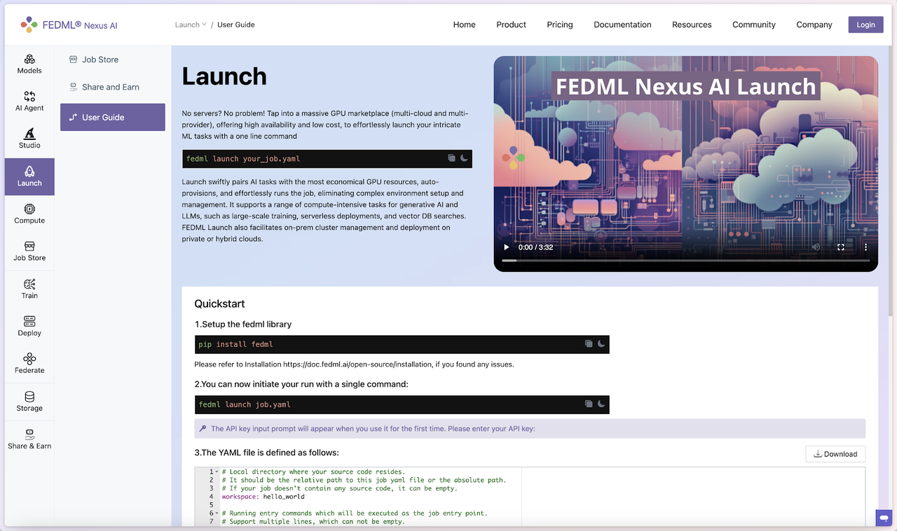
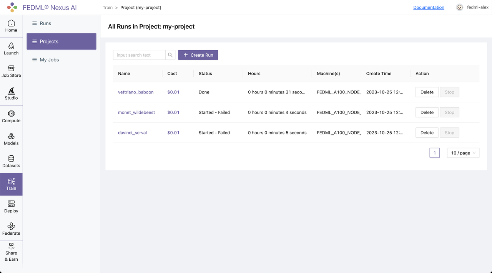
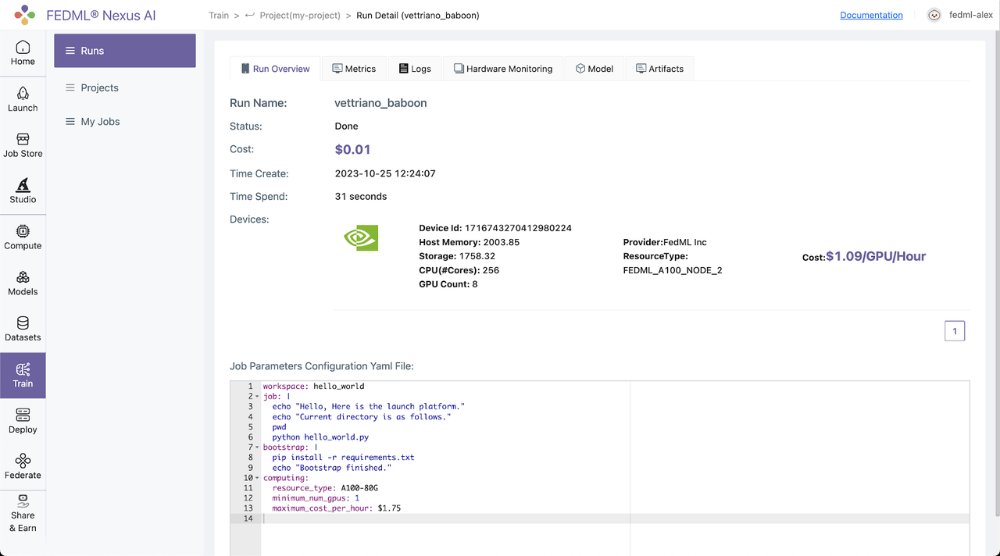

# Train on FEDML Cloud with FEDML Launch, Only Pay Per Usage
“Training as a Cloud Service” at FEDML Nexus AI platform. It provides a variety of GPU types (A100, H100, A6000, RTX4090, etc.) for developers to train your model at any time in a serverless manner. Developers only pay per usage. It includes the following features:
- <strong>Cost-effective training:</strong> Developers do not need to rent or purchase GPUs, developers can initiate serverless training tasks at any time, and developers only need to pay according to the usage time;
- <strong>Flexible Resource Management:</strong> Developers can also create a cluster to use fixed machines and support the cluster autostop function (such as automatic shutdown after 30 minutes) to help you save the cost loss caused by forgetting to shut down the idle resources.
- <strong>Simplified Code Setup:</strong> You do not need to modify your python training source code, you only need to specify the path of the code, environment installation script, and the main entrance through the YAML file
- <strong>Comprehensive Tracking:</strong> The training process includes rich experimental tracking functions, including Run Overview, Metrics, Logs, Hardware Monitoring, Model, Artifacts, and other tracking capabilities. You can use the API provided by FEDML Python Library for experimental tracking, such as fedml.log
- <strong>GPU Availability:</strong> There are many GPU types to choose from. You can go to Secure Cloud or Community Cloud to view the type and set it in the YAML file to use it.
#### FEDML Launch Overview

As shown in the figure above, FEDML Launch works as following consecutive steps:
1. define ML job without code change in a declarative format (e.g., YAML) or reuse our pre-built job templates
2. launch the ML job with just one-line CLI or one-click in GUI
3. search for cheaper GPUs across a large number of GPU providers without price lock-in
4. provision automatically for GPU resources and the software environment setup tailored for the job
5. manage cluster for concurrent jobs with job queue support
6. orchestrate your ML job across multi-nodes/geo-distributed environments, it can be model deployment across GPU nodes, distributed training, or even federated learning across clouds.
7. run and monitor your job with rich observability features so you can see the real-time billing, metrics, logs, system performances, as well as diagnose performance bottlenecks by fine-grained profiling.
<strong>The value proposition of FEDML Launch:</strong>
1. Find the lower prices without cloud vendor lock-in, in any clouds
2. The highest GPU availability, provision in all zones/regions/clouds, even individual GPU contributors from the community
3. Define your scheduling strategies to save money or request resources in a higher priority
4. User-friendly MLOps to save time on environment management (AI docker hub for developers)
5. On-premises GPU cluster management
6. Provide Machine Learning as a Service (MLaaS) with Launch: if you have GPU resources, valuable datasets, or even a foundation model and hope to provide cloud service for your own customers to use them as Inference API or Training As a Service, FEDML Launch would be the off-the-shelf enterprise solution for it.
7. FEDML Launch is versatile in any AI jobs, including training, deployment, and federated learning. It can also be used for complex multi-step jobs such as serving AI agents, building a customized machine learning pipeline for model continual refinement.

#### Quick start

<strong>1. Set up the FEDML library</strong>
Install Python library for interacting with FEDML Launch APIs.
```python
pip install fedml
```
<strong>2. Create job.yaml file</strong>
Before launch any job, at first, you need to define your job properties in the job yaml file, e.g. workspace, job, bootstrap, etc.
Below is an example of job yaml file:
```python
fedml_env:
project_name: my-project
# Local directory where your source code resides.
# It should be the relative path to this job yaml file.
# If your job doesn't contain any source code, it can be empty.
workspace: hello_world
# Bootstrap shell commands which will be executed before running entry commands.
# Support multiple lines, which can be empty.
bootstrap: |
 pip install -r requirements.txt
 echo "Bootstrap finished."
# Running entry commands which will be executed as the job entry point.
# If an error occurs, you should exit with a non-zero code, e.g. exit 1.
# Otherwise, you should exit with a zero code, e.g. exit 0.
# Support multiple lines, which can not be empty.
job: |
   echo "Hello, Here is the launch platform."
   echo "Current directory is as follows."
   pwd
   python hello_world.py
computing:
 minimum_num_gpus: 1      # minimum # of GPUs to provision
 # max cost per hour of all machines for your job.
 # E.g., if your job are assigned 2 x A100 nodes (8 GPUs), each GPU cost $1/GPU/Hour, "maximum_cost_per_hour" = 16 * $1 = $16
 maximum_cost_per_hour: $1.75
 resource_type: A100-80G       # e.g., A100-80G, please check the resource type list by "fedml show-resource-type" or visiting URL: (https://fedml.ai/)accelerator_resource_type
```
For more details and properties about the job yaml file, please refer to [job yaml file]().
<strong>3. Launch a job</strong>
Launch a job to the GPU Cloud.
```python
fedml launch /path/to/job.yaml
```
NOTE: Note that you might be prompted for API_KEY the first time you run the command. Please get this key from your account on FEDML Nexus AI Platform. You can also specify the API_KEY with the -k option.
After the launch CLI is executed, you will get the following output prompting for confirmation of resources:
```python
❯ fedml launch job.yaml -v
Submitting your job to FedML® Nexus AI Platform: 100%|█████████████████████████████| 2.92k/2.92k [00:00<00:00, 16.7kB/s]

Searched and matched the following GPU resource for your job:
+-----------+-------------------+---------+------------+-------------------------+---------+------+----------+
|  Provider |      Instance     | vCPU(s) | Memory(GB) |          GPU(s)         |  Region | Cost | Selected |
+-----------+-------------------+---------+------------+-------------------------+---------+------+----------+
| FedML Inc | FEDML_A100_NODE_2 |   256   |  2003.85   | NVIDIA A100-SXM4-80GB:8 | DEFAULT | 1.09 |    √     |
+-----------+-------------------+---------+------------+-------------------------+---------+------+----------+

You can also view the matched GPU resource with Web UI at:
(https://fedml.ai/launch/confirm-start-job?projectId=1717259066058870784&projectName=my-project&jobId=1717260771043446784)
Do you want to launch the job with the above matched GPU resource? [y/N]:
```
You can either confirm through terminal or may even open the run url to confirm. Once resources are confirmed, it will then run your job, and you will get the following output:
```python
Do you want to launch the job with the above matched GPU resource? [y/N]: y

Launching the job with the above matched GPU resource.
Failed to list run with response.status_code = 200, response.content: b'{"message":"Succeeded to process request","code":"SUCCESS","data":null}'

You can track your run details at this URL:
(https://fedml.ai/train/project/run?projectId=1717259066058870784&runId=1717260771043446784)

For querying the realtime status of your run, please run the following command.
fedml run logs -rid 1717260771043446784
```
<strong>4. Realtime status of your run</strong>
You can query the real time status of your run with the following command.
```python
fedml run logs -rid <run_id>
```
More run management CLIs can be found [here]()
<strong>5. You can also view the details of the run on the FEDML Nexus AI platform:</strong>
Log into to the FEDML Nexus AI Platform (https://fedml.ai) and go to Train > Projects (my_project) Select the run you just launched and click on it to view the details of the run.

Alternatively, you can also go to Train / Runs to find all of your runs scattered across all of your projects unified at a single place.

The URL link to FEDML Nexus AI Platform for your run is printed in the output of the launch command for quick reference.
```python
You can track your run details at this URL:
(https://fedml.ai/train/project/run?projectId=1717259066058870784&runId=1717260771043446784)

For querying the realtime status of your run, please run the following command.
fedml run logs -rid 1717260771043446784
```
This is the quickest, one-click way to go to your run UI. The Run UI offers a lot of information about your run including Metrics, Logs, Hardware Monitoring, Model, Artifacts, as shown in the image below:
